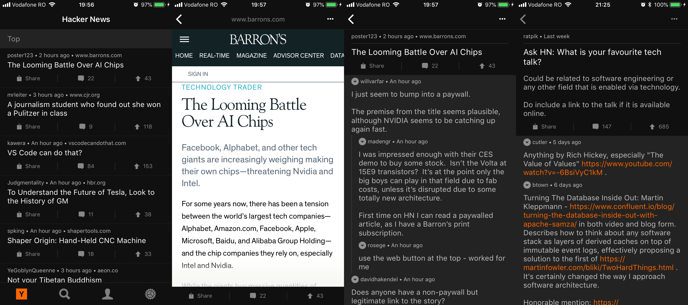
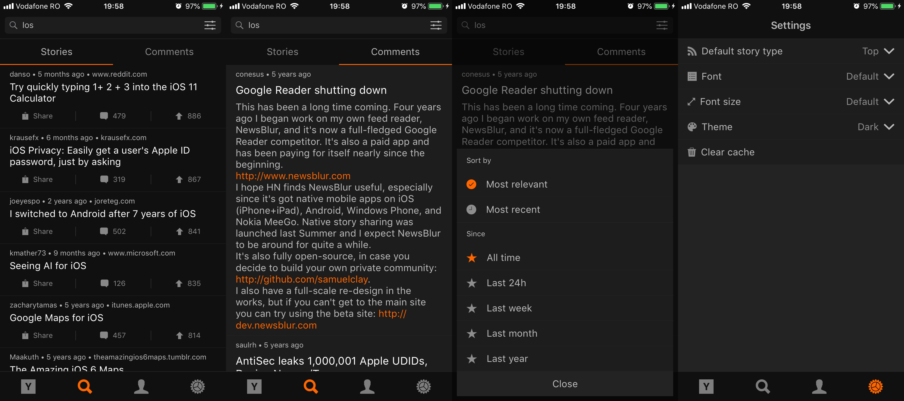
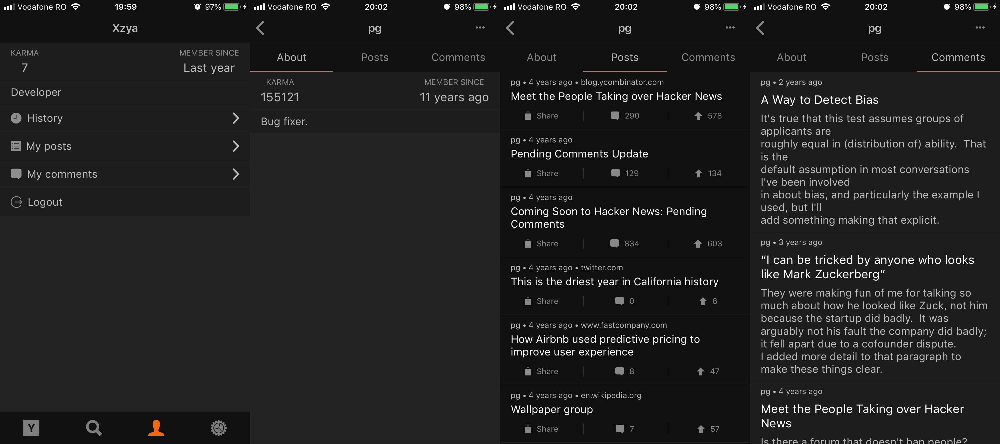

# Hacker News iOS Client

This is a [Hacker News](https://news.ycombinator.com/) iOS client which I wrote some time ago.

It supports most of the things you would expect from a news client with some exceptions (posting stories and commenting is not supported currently), though I wanted to include many more features.

Unfortunately, I lost interest in the project, and I don't think I will work on it any time soon, so I'm open sourcing the code in case someone finds it usefull.

## Screenshots





## Features

- See posts by top/new/best/ask/show/job
- View link inside the app
- View post comments
- Search, powered by Algolia
	- Stories
	- Comments
	- Filter by time period
	- Sort by relevance/recent
- Login/Signup
- View own posts
- View own comments
- History of viewed posts (stored locally on the device)
- Own upvotes
- View other people's profile
	- About
	- Posts
	- Comments
- Themes
- Change font/size

## Not supported

- Post story
- Reply to post

## Running the project

### Requirements 

- XCode 8+
- iOS 9+
- [CocoaPods](https://cocoapods.org/)

### Run

```bash
pod install
```

Open `HackerNews.xcworkspace`.

## License

Open sourced under the [MIT license](./LICENSE.md).